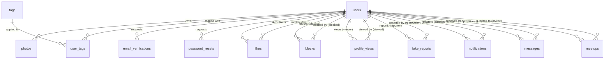

# Matcha

A dating-site web app (42 school "Matcha" project, see `fr.subject.pdf`). Backend is Express + PostgreSQL (`back/`), frontend is React + Vite (`front/`), realtime features (chat, notifications, live meetup updates) run over Socket.io.

## Running it

```sh
make i        # install backend + frontend deps
make back     # start postgres (docker) + backend dev server
make front    # start frontend dev server
make seed     # seed the DB with fake profiles (postgres must be up)
make prod     # docker-compose up --build, full stack
```

## Database schema

Postgres, plain SQL migrations in `back/db/migrations/`, run in order by `back/src/scripts/migrate.js` (each file is idempotent — `IF NOT EXISTS` / `DROP CONSTRAINT IF EXISTS` — so it's safe to re-run against an existing DB).

### Entity-relationship overview



All `user_id`-style foreign keys are `ON DELETE CASCADE` — deleting a user wipes their photos, tags, likes, blocks, messages, notifications and meetups along with them.

### Auth (`001`, `002`, `003`)

**users**
| Column | Type | Notes |
|---|---|---|
| id | serial PK | |
| email | varchar(255) | unique, not null |
| username | varchar(50) | unique, not null |
| first_name / last_name | varchar(100) | not null |
| password_hash | text | not null, argon2 |
| verified | boolean | default false |
| gender | varchar(10) | `male` \| `female` ([binary by design](#design-notes)) |
| sexual_orientation | varchar(20) | `heterosexual` \| `homosexual` \| `bisexual`, **not null, default `bisexual`** |
| birth_date | date | nullable until profile completed |
| bio | text | nullable |
| latitude / longitude | double precision | nullable |
| location_label | varchar(255) | human-readable location, nullable |
| location_source | varchar(10) | `gps` \| `manual`, nullable |
| popularity_score | integer | not null, default 0, see [formula](#design-notes) |
| last_seen | timestamp | updated on each authenticated request |
| created_at | timestamp | default now() |

**email_verifications** / **password_resets** — identical shape: `id`, `user_id → users.id`, `token` (unique, text), `expires_at`, `used` (boolean, default false). `password_resets` additionally has `created_at`.

### Profile data (`005`, `006`)

**tags**: `id` PK, `name` varchar(30) unique, `CHECK (name ~ '^[a-z0-9_]+$')`.

**user_tags**: `user_id → users.id`, `tag_id → tags.id`, composite PK `(user_id, tag_id)` — many-to-many join table.

**photos**
| Column | Type | Notes |
|---|---|---|
| id | serial PK | |
| user_id | int → users.id | |
| file_name | text | not null, randomly generated on disk |
| is_profile | boolean | not null, default false |
| position | smallint | not null, default 0, manual ordering |
| created_at | timestamp | default now() |

Partial unique index `one_profile_photo_per_user` on `(user_id) WHERE is_profile` — enforces at most one profile photo per user at the DB level.

### Social graph (`007`–`010`)

**likes** / **blocks** / **fake_reports** all follow the same shape: `id` PK, two `user_id` FKs (`liker_id`/`liked_id`, `blocker_id`/`blocked_id`, `reporter_id`/`reported_id`), `created_at`, a `CHECK` that the two ids differ, and a unique constraint on the pair (so liking/blocking/reporting twice is a no-op via `ON CONFLICT DO NOTHING` at the app layer).

**profile_views**: `id` PK, `viewer_id`/`viewed_id → users.id`, `viewed_at` (default now()), `CHECK (viewer_id <> viewed_id)`. No uniqueness constraint — every view is logged separately (used for the "popularity" formula and the visitors list).

> A "match" (the subject's *connecté*) isn't its own table — it's computed as a mutual pair in `likes` (`hasLiked(a,b) AND hasLiked(b,a)`). Chat and meetups gate on this same check.

### Notifications (`011`, `013`)

**notifications**
| Column | Type | Notes |
|---|---|---|
| id | serial PK | |
| user_id | int → users.id | recipient |
| actor_id | int → users.id, nullable | who triggered it |
| type | varchar(20) | `CHECK`-constrained enum, see below |
| is_read | boolean | not null, default false |
| created_at | timestamp | default now() |

`type` ∈ `like`, `unlike`, `profile_view`, `message`, `match`, `meetup_invite`, `meetup_accepted`, `meetup_declined`, `meetup_cancelled` (widened from the original 5 values by migration `013` when meetups were added). Index on `(user_id, is_read)` for the unread-count query.

### Chat (`012`)

**messages**: `id` PK, `sender_id`/`recipient_id → users.id`, `body` text not null, `read_at` (nullable timestamp), `created_at` not null default now(). Indexes: `(LEAST(sender_id,recipient_id), GREATEST(sender_id,recipient_id), created_at)` for fetching a conversation regardless of who sent what, and `(recipient_id, read_at)` for unread counts. No `conversations` table — a conversation is just the message history between two ids, gated on the pair currently being mutually-liked (or having prior history) at the service layer.

### Meetups (`014`)

**meetups**
| Column | Type | Notes |
|---|---|---|
| id | serial PK | |
| proposer_id | int → users.id | who proposed it |
| invitee_id | int → users.id | who it was proposed to |
| location_label | varchar(255) | not null |
| scheduled_at | timestamp | not null |
| status | varchar(20) | `pending` \| `accepted` \| `declined` \| `cancelled`, default `pending` |
| created_at | timestamp | not null, default now() |

`CHECK (proposer_id <> invitee_id)`. Indexes on `(invitee_id, status)` and `(proposer_id, status)`. Proposing requires the two users to be mutually liked (same "connected" check as chat).

## Design notes

A few gaps in the subject text were filled with explicit decisions, kept here so they don't get silently relitigated:

- **`gender` is binary** (`male`/`female`), not an open set — the subject's worked examples and the hetero/homo/bi orientation model only make sense relative to a binary gender. A non-binary option would require redesigning the orientation-matching logic in discovery/search, not just adding a column value.
- **`birth_date` exists on `users`** even though the subject's profile field list doesn't mention it — age filtering/sorting (required elsewhere in the subject) is impossible without it.
- **`sexual_orientation` defaults to `'bisexual'` in the DB itself** (not nullable + app-level fallback) — the subject says unspecified orientation should be treated as bisexual for matching, so baking it into the column default avoids null-coalescing in every matching query.
- **Popularity score** is a cached, incrementally-updated column (`users.popularity_score`), not computed on read: `views×1 + likes_received×5 − (unlikes + blocks_received)×3`, floored at 0.
- **Location** is plain `latitude`/`longitude` doubles + a `location_label` string, no PostGIS — project scale doesn't need a geospatial index, and a Haversine calculation in the query is enough (see `discover.repository.js`).
